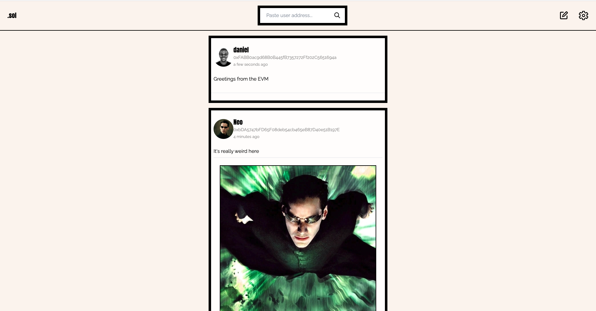

# Solidus

Decentralized social network built on the Ethereum blockchain

<b>Features</b>

- User timeline: A feed that displays posts from a specific user.
- Feed: Displays posts from followed users
- Follow and unfollow: The ability to subscribe to or unsubscribe from updates from other users.
- Post creation: Users can make new posts that contain both text and images.
- Profile updates: Users can edit their personal information, such as their name, bio, and profile picture.

